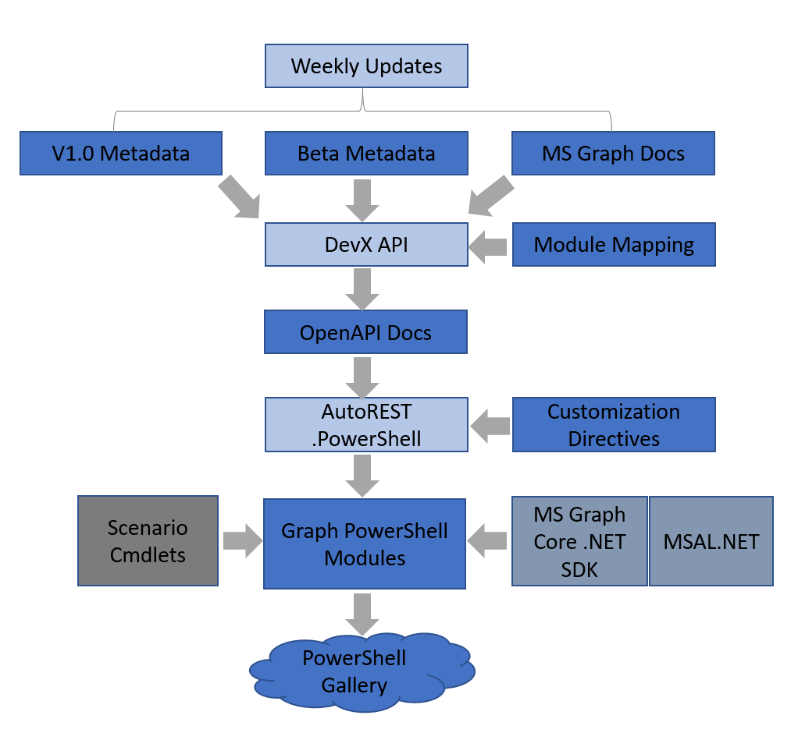

# Generation Process

## Introduction

Before the SDK is generated, we first capture both v1.0 and beta metadata from the Microsoft Graph service. This is captured every week and store them in [microsoftgraph/msgraph-metadata](https://github.com/microsoftgraph/msgraph-metadata) repo where it is cleaned, and injected with descriptions from [Microsoft Graph docs](https://docs.microsoft.com/en-us/graph/api/overview?toc=.%2Fref%2Ftoc.json&view=graph-rest-1.0).

The clean metadata is then converted to an [OpenAPI](https://github.com/OAI/OpenAPI-Specification) document using DevX API. This produces an OpenAPI V3 document in yaml that describes all API paths in Microsoft Graph.

Given the large surface area of Microsoft Graph, we slice the resultant OpenAPI document into smaller module specific documents using the mapping found in [ModulesMapping.jsonc](https://github.com/microsoftgraph/msgraph-sdk-powershell/blob/dev/config/ModulesMapping.jsonc).

Each module specific OpenAPI document is then ran through [AutoREST.PowerShell](https://github.com/Azure/autorest.powershell) to generate a PowerShell binary module containing models and cmdlets.

We then wire-up the generated module with our [Microsoft Graph Core .NET SDK](https://github.com/microsoftgraph/msgraph-sdk-dotnet-core) and [MSAL.NET](https://github.com/AzureAD/microsoft-authentication-library-for-dotnet) to setup an [HTTP pipeline](https://github.com/microsoftgraph/msgraph-sdk-design/blob/master/README.md) that is pre-configured with a number of middleware such as authentication handler, retry handler, redirect handler, compression handler, etc.

The generated cmdlets can further be modified using customization directives. Scenario based cmdlets can also be added using code level customization. See customization section below for more details.

Once all the modules are generated, we pack them into `.nupkg` files and publish to PowerShell Gallery.



***N.B - Generating the SDK is currently limited to only Windows, but we have plans to support Linux and MacOS in the future. The SDK can however be used on any platform (Windows, Linux, or MacOS).***

## SDK Generation

### Prerequisite

#### Service

- Service design is finalized, and schema is published to either [v1.0](https://graph.microsoft.com/v1.0/$metadata) or [beta](https://graph.microsoft.com/beta/$metadata) metadata.

#### Tools

- [Download](https://github.com/PowerShell/PowerShell/releases) and install PowerShell 6 or greater.
- Install AutoREST using npm. This requires [NodeJS](https://nodejs.org/) to be installed on your system.

    ``` powershell
    npm install -g "@autorest/autorest"
    ```

- Install .NET Core SDK 2.2 or greater.

    ``` powershell
    npm install -g dotnet-sdk-2.2
    ```

- Clone [msgraph-sdk-powershell](https://github.com/microsoftgraph/msgraph-sdk-powershell) repo locally.

    ``` powershell
    git clone https://github.com/microsoftgraph/msgraph-sdk-powershell.git
    ```

### Generation Steps

1. Generate `Microsoft.Graph.Authentication` module

    ``` powershell
    # Builds amd runs all enabled tests.
    \msgraph-sdk-powershell\tools\GenerateAuthenticationModule.ps1 -Build -Test
    ```

2. Generate service modules
  
    Ensure modules mapping is up to date and your services’ entity set or singleton are properly mapped to a module.

    ``` powershell
    # Holds a mapping of APIs to module.
    \msgraph-sdk-powershell\config\ModulesMapping.jsonc
    ```

    - Update both v1.0 and beta OpenAPI documents (optional).

        ``` powershell
        # Refreshes all OpenAPI documents with the latest metadata.
        \msgraph-sdk-powershell\tools\UpdateOpenApi.ps1 # (v1.0)
        \msgraph-sdk-powershell\tools\UpdateOpenApi.ps1 -BetaGraphVersion # (beta)
        ```

    - Generate beta and v1.0 profiles (optional).

        ``` powershell
        # Generates a version profile of all modules.
        \msgraph-sdk-powershell\tools\GenerateProfiles.ps1
        ```

    - Generate service modules.

        - To generate all service modules present in the SDK, run:

            ``` powershell
            # Builds amd runs all enabled tests
            \msgraph-sdk-powershell\tools\GenerateModule.ps1 -Build -Test
            ```

            This generates, builds, and runs all enabled tests for all the modules defined in modules mapping config file and can take several hours.
        - Optionally, you can generate the modules that you are interested in by specifying an array of module names to `-ModulesToGenerate` parameter when running `GenerateModule.ps1`:

            ``` powershell
            \msgraph-sdk-powershell\tools\GenerateModule.ps1 -Build -Test –ModulesToGenerate "Users", "DeviceManagement.Administration"
            ```

3. Generate `Microsoft.Graph` module (meta/roll-up module)

    ``` powershell
    # Generates roll-up module.
    \msgraph-sdk-powershell\tools\GenerateRollUpModule.ps1
    ```

## Customization

This involves making modification to the generated commands in the service modules. Before making any customization to the generated cmdlets, please read through the [PowerShell Design Guidelines](https://docs.microsoft.com/en-us/powershell/scripting/developer/cmdlet/strongly-encouraged-development-guidelines?view=powershell-7.1).

Customization can generally be done in two ways:

- Through directives:
  - See <https://github.com/Azure/autorest.powershell/blob/master/docs/directives.md>
- Through code level customization:
  - See <https://github.com/Azure/autorest.powershell/blob/master/docs/customization.md>

## References

- AutoREST.PowerShell Guide - <https://github.com/Azure/autorest.powershell/tree/master/docs>.
- Examples:
  - Complete generated module with directives - <https://github.com/microsoftgraph/msgraph-sdk-powershell/tree/dev/src/Applications/Applications>.
  - Scenario based cmdlets through code level customization - <https://github.com/microsoftgraph/msgraph-sdk-powershell/tree/dev/src/Groups/Groups/custom>.
- Contribution guide - <https://github.com/microsoftgraph/msgraph-sdk-powershell/blob/dev/CONTRIBUTING.md>.
